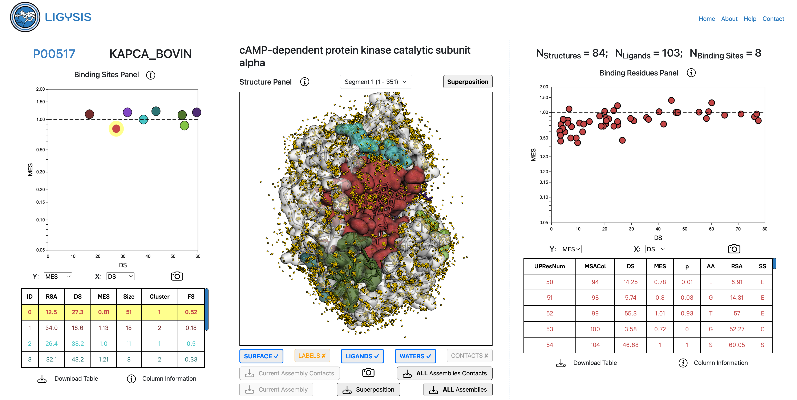

# LIGYSIS web

This is the repository for out ligand binding site analysis, **LIGYSIS**, [web server](https://www.compbio.dundee.ac.uk/ligysis/). LIGYSIS is a Python Flask Web application.

## Dependencies

Third party dependencies include:

- [3Dmol.js](https://3dmol.csb.pitt.edu/doc/index.html) [(BSD 3-Clause License)](https://github.com/3dmol/3Dmol.js/blob/master/LICENSE)
- [Chart.js](https://www.chartjs.org/) [(MIT License)](https://github.com/chartjs/Chart.js/blob/master/LICENSE.md)

Other dependencies constitute standard Python libraries:

- [Flask](https://flask.palletsprojects.com/en/stable/) [(BSD 3-Clause License)](https://github.com/pallets/flask/blob/main/LICENSE.txt)
- [Numpy](https://numpy.org/) [(BSD 3-Clause License)](https://github.com/numpy/numpy/blob/main/LICENSE.txt)
- [Pandas](https://pandas.pydata.org/) [(BSD 3-Clause License)](https://github.com/pandas-dev/pandas/blob/main/LICENSE)
  
## Installation

To install **LIGYSIS WEB** locally, you must simply create the `LIGYSIS_WEB` enviornment with the following command:

```sh
conda create -n LIGYSIS_WEB python numpy pandas flask
```

This will install the necessary libraries to locally run the LIGYSIS web app.

## Run the app

After installation, this is how you can run the LIGYSIS app locally:

```sh
# activate LIGYSIS_WEB conda environment
conda activate LIGYSIS_WEB

# run the LIGYSIS app
python app.py
```

We do not offer full LIGYSIS dataset download, so a local installation of the LIGYSIS web app would only make sense if the customised **LIGYSIS** [pipeline](https://github.com/JavierSanchez-Utges/ligysis_custom/tree/revamped) was installed and a user wanted to explore their results locally without relying on our public server.

## User job submission

## Results page

The results page of the application is divided in three panels: Binding Sites Panel (**left**), Structure Panel (**centre**) and Binding Site Residues panel (**right**). These panels are interactive and connected thhrough hover and click events.



### Binding Sites Panel

This panel is formed by the protein's [UniProt](https://www.uniprot.org/) accession ID and entry name, an interactive Chart.js graph and a table which display the binding site features, averaged from the residues forming them. These features include average [Relative Solvent Accessibility](https://en.wikipedia.org/wiki/Relative_accessible_surface_area) (RSA)[[1](https://journals.plos.org/plosone/article?id=10.1371/journal.pone.0080635)], Normalised Shenkin Divergence Score (DS) [[2](https://doi.org/10.1002/prot.340110408), [3](https://journals.plos.org/ploscompbiol/article?id=10.1371/journal.pcbi.1009335)], Missense Enrichment Score (MES) [[4](https://www.biorxiv.org/content/10.1101/127050v2), [5](https://onlinelibrary.wiley.com/doi/full/10.1002/pro.3783), [6](https://www.nature.com/articles/s42003-024-06117-5)], binding site size, i.e., number of binding site residues (Size), RSA-derived Cluster (Cluster) [[7](https://www.nature.com/articles/s42003-024-05970-8)] and RSA-derived Functional Score (FS).

Variables on each axis can be changed, to explore the relationship between the different features and a screenshot of the graph can be saved. Columns of the table can be sorted by value and the data saved to a <i>.csv</i> file. Both the graph and the table react to hover and click events displaying the sites on the structure panel. Hover events will have a temporary effect, whilst clicking on a data point or row will fix the corresponding binding site on the structure panel, until another site is clicked or the same site clicked again (unclicked). These events can be easily tracked by a **yellow** highlight on points and rows when hovered on or **green** when clicked.

### Structure Panel

This is the central panel of the **LIGYSIS web** results page. At the very top, we find the name of the protein of interest, and below, the structural segment selector, as defined by the [PDBe-KB](https://www.ebi.ac.uk/pdbe/pdbe-kb/) [[8](https://pubs.aip.org/aca/sdy/article/11/3/034701/3294234)] as well as the structure selector. By default, the ligand superposition view is shown, which has a single protein scaffold and the heteroatoms (non-protein atoms) of all other structures for a given protein segment. A user can click on this drop-up and explore the biological assembly of any of the chains in the superposition. Transformation matrices for the superposition were obtained from the [PDBe FTP site](https://ftp.ebi.ac.uk/pub/databases/pdbe-kb/superposition/P/P00517/).

At the very centre of the panel, we find the [3DMol.js](https://3dmol.csb.pitt.edu/doc/index.html) [[9](https://academic.oup.com/bioinformatics/article/31/8/1322/213186), [10](https://pubs.acs.org/doi/10.1021/acs.jchemed.0c00579)] structure viewer with a white protein chain cartoon representation. Buttons are implemented to show/hide surfaces, residue labels, ligand, water molecules and protein-ligand contacts as calculated by [pdbe-arpeggio](https://github.com/PDBeurope/arpeggio) [[11](https://www.sciencedirect.com/science/article/pii/S0022283616305332?via%3Dihub)].

## Citation

If you use the **LIGYSIS** web application, please cite:

**Utgés JS**, MacGowan SA, Ives CM, Barton GJ. Classification of likely functional class for ligand binding sites identified from fragment screening. Commun Biol. 2024 Mar 13;7(1):320. doi: [10.1038/s42003-024-05970-8](https://www.nature.com/articles/s42003-024-05970-8). PMID: 38480979; PMCID: PMC10937669.

**Utgés JS** & Barton GJ. Comparative evaluation of methods for the prediction of protein-ligand binding sites, 08 August 2024, PREPRINT (Version 1) available at Research Square [https://doi.org/10.21203/rs.3.rs-4849153/v1](https://doi.org/10.21203/rs.3.rs-4849153/v1)

**Utgés JS**, MacGowan SA, Barton GJ. LIGYSIS-web: a resource for the analysis of protein-ligand binding sites. 2025. <i>Work in progress...</i>.

## References

1. Tien MZ, Meyer AG, Sydykova DK, Spielman SJ, Wilke CO. Maximum allowed solvent accessibilites of residues in proteins. PLoS One. 2013 Nov 21;8(11):e80635. doi: [10.1371/journal.pone.0080635](https://journals.plos.org/plosone/article?id=10.1371/journal.pone.0080635). PMID: 24278298; PMCID: PMC3836772.

2. Shenkin PS, Erman B, Mastrandrea LD. Information-theoretical entropy as a measure of sequence variability.
Proteins. 1991; 11(4):297–313. Epub 1991/01/01. [https://doi.org/10.1002/prot.340110408](https://doi.org/10.1002/prot.340110408)
PMID: 1758884.

3. **Utgés JS**, Tsenkov MI, Dietrich NJM, MacGowan SA, Barton GJ. Ankyrin repeats in context with human population variation. PLoS Comput Biol. 2021 Aug 24;17(8):e1009335. doi: [10.1371/journal.pcbi.1009335](https://journals.plos.org/ploscompbiol/article?id=10.1371/journal.pcbi.1009335). PMID: 34428215; PMCID: PMC8415598.

4. MacGowan, SA, Madeira, F, Britto-Borges, T, Schmittner, MS, Cole, C, & Barton, GJ (2017). Human missense variation is constrained by domain structure and highlights functional and pathogenic residues. bioRxiv, 127050. [https://doi.org/10.1101/127050](https://www.biorxiv.org/content/10.1101/127050v2).

5. MacGowan SA, Madeira F, Britto-Borges T, Warowny M, Drozdetskiy A, Procter JB, Barton GJ. The Dundee Resource for Sequence Analysis and Structure Prediction. Protein Sci. 2020 Jan;29(1):277-297. doi: [10.1002/pro.3783](https://onlinelibrary.wiley.com/doi/full/10.1002/pro.3783). Epub 2019 Nov 28. PMID: 31710725; PMCID: PMC6933851.

6. MacGowan SA, Madeira F, Britto-Borges T, Barton GJ. A unified analysis of evolutionary and population constraint in protein domains highlights structural features and pathogenic sites. Commun Biol. 2024 Apr 11;7(1):447. doi: [10.1038/s42003-024-06117-5](https://www.nature.com/articles/s42003-024-06117-5). PMID: 38605212; PMCID: PMC11009406.
   
7. **Utgés JS**, MacGowan SA, Ives CM, Barton GJ. Classification of likely functional class for ligand binding sites identified from fragment screening. Commun Biol. 2024 Mar 13;7(1):320. doi: [10.1038/s42003-024-05970-8](https://www.nature.com/articles/s42003-024-05970-8). PMID: 38480979; PMCID: PMC10937669.

8. Ellaway JIJ, Anyango S, Nair S, Zaki HA, Nadzirin N, Powell HR, Gutmanas A, Varadi M, Velankar S. Identifying protein conformational states in the Protein Data Bank: Toward unlocking the potential of integrative dynamics studies. Struct Dyn. 2024 May 17;11(3):034701. doi: [10.1063/4.0000251](https://pubs.aip.org/aca/sdy/article/11/3/034701/3294234). PMID: 38774441; PMCID: PMC11106648.

9. Rego N, Koes D. 3Dmol.js: molecular visualization with WebGL. Bioinformatics. 2015 Apr 15;31(8):1322-4. doi: [10.1093/bioinformatics/btu829](https://academic.oup.com/bioinformatics/article/31/8/1322/213186). Epub 2014 Dec 12. PMID: 25505090; PMCID: PMC4393526.

10. Seshadri K, Liu P, Koes DR. The 3Dmol.js learning environment: a classroom response system for 3D chemical structures. J Chem Educ. 2020 Oct 13;97(10):3872-3876. doi: [10.1021/acs.jchemed.0c00579](https://pubs.acs.org/doi/10.1021/acs.jchemed.0c00579). Epub 2020 Aug 25. PMID: 36035779; PMCID: PMC9416521.

11. Jubb HC, Higueruelo AP, Ochoa-Montaño B, Pitt WR, Ascher DB, Blundell TL. Arpeggio: A Web Server for Calculating and Visualising Interatomic Interactions in Protein Structures. J Mol Biol. 2017 Feb 3;429(3):365-371. doi: [10.1016/j.jmb.2016.12.004](https://www.sciencedirect.com/science/article/pii/S0022283616305332?via%3Dihub). Epub 2016 Dec 10. PMID: 27964945; PMCID: PMC5282402.

